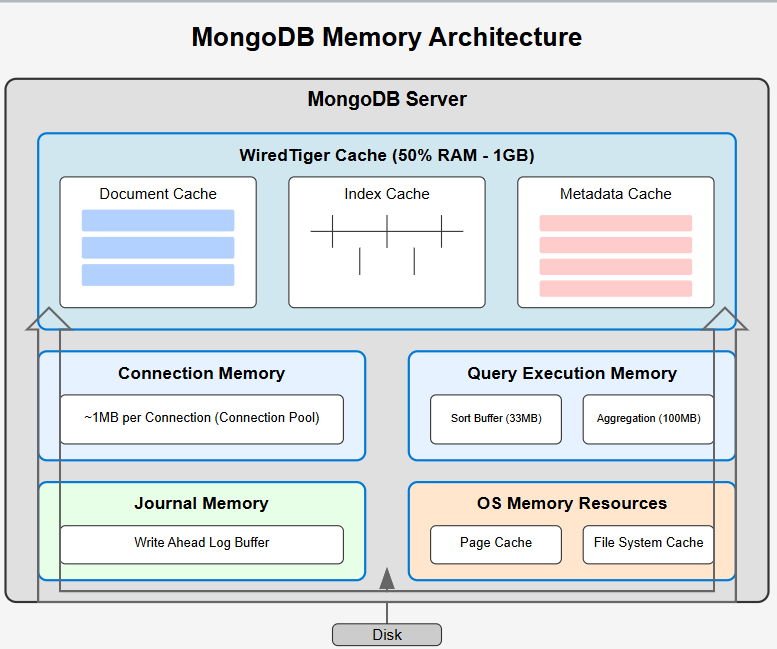

# MongoDB Preparation Topics

- **MongoDB Overview**
  ✅ What is MongoDB
  ✅ Document-oriented NoSQL database
  ✅ MongoDB vs RDBMS
  ✅ Databases
  ✅ Collections
  ✅ Documents
  ✅ BSON data format, basics and types
  ✅ ObjectId
  ✅ MongoDB Cursor
  ✅ MongoDB data types

- **CRUD Operations**
  ✅ Create database and collection
  ✅ Drop database and collection

- **Insert Operations**
  ✅ insertOne() method
  ✅ insertMany() method

- **Update Operations**
  ✅ updateOne() method
  ✅ updateMany() method
  ✅ replaceOne() method

- **Delete Operations**
  ✅ Delete single document
  ✅ Delete multiple documents
  ✅ deleteOne() method

- **Read Operations**
  ✅ find() method
  ✅ findOne() method
  ✅ findAndModify() method
  ✅ findOneAndDelete() method
  ✅ findOneAndUpdate() method
  ✅ findOneAndReplace() method
  ✅ skip() method
  ✅ limit() method
  ✅ sort() method

- **Query Operations**
  ✅ Query embedded / nested documents
  ✅ Query arrays
  ✅ Query null or missing fields
  ✅ Query operators
  ✅ Projection operators

- **MongoDB Operators**
  ✅ Comparison operators
    ✅ Comparison query operators
    ✅ $cmp
    ✅ $gt
    ✅ $lt
    ✅ $eq
  - Logical operators
    ✅ $and
    ✅ $or
    ✅ $not
    ✅ $nor
  - Arithmetic operators
    ✅ $add
    ✅ $subtract
    ✅ $multiply
    ✅ $divide
    ✅ $abs
    ✅ $floor
  - Field update operators
    ✅ $max
    ✅ $min
    ✅ $inc
    ✅ $mul
    ✅ $rename
  - Array expression operators
    ✅ $isArray
    ✅ $size
    ✅ $arrayElemAt
    ✅ $concatArrays
    ✅ $reverseArray
  - Array update operators
    ✅ $pull
    ✅ $pop
    ✅ $pullAll
    ✅ $push
    ✅ Positional operator ($)
    ✅ All positional operator ($[])
  - String expression operators
    ✅ $concat
    ✅ $strcasecmp
    ✅ $toUpper
    ✅ $toLower
    ✅ $substrCP

- **Aggregation**
  - Aggregation framework
  - Aggregation pipeline
  - Updates using aggregation pipeline
  - Pipeline stages
  - Pipeline optimization
  - Pipeline limits
  - Aggregation commands
    - $out
    - $count
    - $group
    - $lookup
    - $first
    - $unwind
  - Aggregation tools
    - Map-Reduce

- **Indexing**
  - Index concepts
  - Create index
  - Get index
  - Drop index
  - Index types
    - Single field index
    - Compound index
    - Multikey index
    - Text index

- **Transactions and Data Modeling**
  - Transactions in MongoDB
  - ACID transactions
  - Transactions in Mongoose
  - Data modeling principles
  - Relationships in MongoDB
  - Embedded documents
  - JSON schema validation

- **Scaling in MongoDB**
  - Replication
  - Sharding
  - Change streams
  - Replica set members
  - Replica set deployment
  - Sharded cluster components
  - Shard keys
  - Hashed sharding
  - Ranged sharding
  - Read and write semantics
  - Sharding deployment architectures

- **Security**
  - MongoDB security fundamentals
  - Securing MongoDB
  - Access control
  - Authentication
  - Role-based access control (RBAC)

- Advanced Topics
  - Performance tuning
  - Backup and restore
  - Monitoring and troubleshooting
  - MongoDB Atlas overview
  - Views in MongoDB
  - Time Series Collections